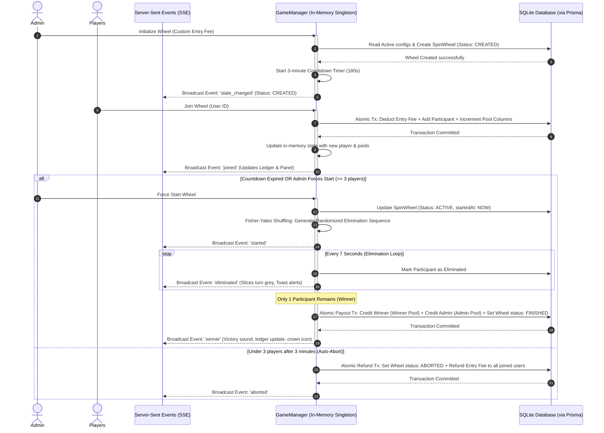

# 🌟 ROXSTAR Spin Wheel Game System
### Real-Time Multiplayer Spin Wheel Game System in Next.js

A high-fidelity, real-time multiplayer spin wheel tournament game system built with **Next.js**, **TypeScript**, **Prisma ORM**, and **SQLite**. Users can pay entry fees in coins, register in the tournament pool, witness animated slice-by-slice eliminations in real-time, and compete for a dynamically distributed prize pool.

---

## 🚀 Key Features

*   **Real-Time Multiplayer Play**: Full real-time synchronization utilizing Native HTML5 **Server-Sent Events (SSE)** for high-performance updates without heavy dependencies (e.g., Socket.io).
*   **Atomic Coin Distribution System**: Complete transaction integrity. Entry fees are immediately split into dedicated pools (**Winner Pool**, **Admin/Owner Commission**, and **App Treasury**) and tracked cumulative-column wise. All payouts and refunds run inside strict atomic database transaction blocks.
*   **Database-Driven Configurations**: All pool shares (percentages) and default fees are fully database-driven, allowing on-the-fly updates by administrators.
*   **Interactive Visual Spin Wheel**: Canvas-drawn glowing wheel where segments dynamically fade out into deep grey as users are eliminated, offering high visual feedback.
*   **Multiplayer Sandbox Selector**: Easily switch identities between pre-seeded users and admins directly in the header to simulate multiple concurrent players from a single browser.
*   **Database Transaction Ledger**: A live ledger detailing historical transactions (entry fees, win payouts, refunds, and adjustments) directly from the SQLite database.

---

## 🛠 Tech Stack

*   **Framework**: Next.js 16 (App Router)
*   **Language**: TypeScript
*   **Database**: SQLite (WAL Mode enabled by default for concurrent reads/writes)
*   **ORM**: Prisma v7 (using Native NodeJS SQLite Driver Adapter `@prisma/adapter-better-sqlite3` for extreme transactional performance)
*   **Real-time Layer**: Server-Sent Events (SSE) (via HTTP readable streams in Route Handlers)
*   **Icons**: Lucide React
*   **Design & Theme**: Vanilla CSS (High-end Glassmorphism, Dark Neon theme, micro-animations)

---

## 📊 High-Level Architecture Flow



---

## 📦 Getting Started & Installation

### Prerequisites
*   Node.js (v18.x or higher)
*   npm (v9.x or higher)

### Setup Steps

1.  **Clone the Repository** and navigate to the project directory.
2.  **Install dependencies**:
    ```bash
    npm install
    ```
3.  **Run Database Migrations**:
    Apply the SQLite migrations and prepare the schema:
    ```bash
    npx prisma migrate dev --name init
    ```
4.  **Seed the Database**:
    Seeding inserts game configuration parameters (splits) and spawns 1 Admin (`admin`) and 5 Players (`alex`, `bella`, `charlie`, `david`, `emma`) with initial coin balances:
    ```bash
    npx prisma db seed
    ```
5.  **Launch the Dev Server**:
    ```bash
    npm run dev
    ```
6.  **Open the App**:
    Navigate to [http://localhost:3000](http://localhost:3000) in your web browser.

---

## 🗄 Database Schema Design

The application utilizes five SQLite database tables modeled in `prisma/schema.prisma`:

### 1. `User`
Tracks individual user accounts, authorization roles, and current wallet balances.
*   `id` (UUID, Primary Key)
*   `username` (String, Unique)
*   `role` (String, Default: `"USER"`, values: `"USER"`, `"ADMIN"`)
*   `coins` (Float, Default: `1000.0` - provides demo currency)

### 2. `SpinWheel`
Stores configuration, cumulative stakes, and metadata for every game wheel created.
*   `id` (UUID, Primary Key)
*   `status` (String, Default: `"CREATED"`, values: `"CREATED"`, `"ACTIVE"`, `"FINISHED"`, `"ABORTED"`)
*   `entryFee` (Float, Default: `100.0`)
*   `winnerPoolShare` / `adminPoolShare` / `appPoolShare` (Float values representing percentage splits at creation)
*   `winnerPoolAccumulated` / `adminPoolAccumulated` / `appPoolAccumulated` (Float values tracking cumulative coins per pool column)
*   `winnerId` (UUID, Nullable Foreign Key to `User`)

### 3. `SpinWheelParticipant`
Tracks mapping between users and active/past wheels, marking elimination structures.
*   `id` (UUID, Primary Key)
*   `spinWheelId` (UUID, Foreign Key)
*   `userId` (UUID, Foreign Key)
*   `joinedAt` (DateTime)
*   `eliminatedAt` (DateTime, Nullable)
*   `eliminationOrder` (Integer, Nullable - e.g., 1, 2, 3...)
*   **Unique Index**: `[spinWheelId, userId]` - prevents double-entry

### 4. `CoinTransaction`
The global ledger. Records every debit, credit, refund, and payout.
*   `id` (UUID, Primary Key)
*   `userId` (UUID, Foreign Key)
*   `spinWheelId` (UUID, Nullable Foreign Key)
*   `amount` (Float - positive for credits, negative for debits)
*   `type` (String, values: `"INITIAL_CREDIT"`, `"ENTRY_FEE"`, `"REFUND"`, `"WIN_PAYOUT"`, `"ADMIN_PAYOUT"`, `"ADMIN_ADJUSTMENT"`)
*   `description` (String)

### 5. `GameConfig`
Key-Value configurations store database-driven percentages.
*   `key` (String, Primary Key - e.g. `'winner_share'`, `'admin_share'`)
*   `value` (String)

---

## 💰 Atomic Coin Distribution & Safety

To ensure perfect fairness and prevent race conditions or partial updates, all coin adjustments are bundled into atomic Database Transactions (`prisma.$transaction`).

### 1. Joining Phase (Debit & Pool Accumulate)
*   Read-locks user balance to verify they have `>= entryFee` coins.
*   Deducts `entryFee` from `User.coins`.
*   Applies percentage arithmetic based on active `winnerPoolShare`, `adminPoolShare`, and `appPoolShare`.
*   Increments cumulative columns `winnerPoolAccumulated`, `adminPoolAccumulated`, and `appPoolAccumulated` on the `SpinWheel` record.
*   Registers `SpinWheelParticipant` mapping.
*   Creates `ENTRY_FEE` coin transaction log.
*   *If any step fails, the entire transaction is rolled back.*

### 2. Auto-Abort / Refund Phase
If a wheel expires with fewer than 3 participants:
*   Sets status to `"ABORTED"`.
*   Fetches registered participants.
*   Iterates through each participant, incrementing `User.coins` by the exact `entryFee`.
*   Writes a `"REFUND"` transaction record in the ledger for each user.
*   *Committed atomicly to ensure no player experiences a lost stake.*

### 3. Final Payout Phase (Credit Winner & Admin)
*   Marks status to `"FINISHED"`.
*   Locates the primary platform Administrator.
*   Credits Winner's wallet by adding `winnerPoolAccumulated`. Writes `"WIN_PAYOUT"` transaction.
*   Credits Admin's wallet by adding `adminPoolAccumulated`. Writes `"ADMIN_PAYOUT"` transaction.
*   *App Pool accumulations remain logged in the AppPoolAccumulated column for ledger audits.*

---

## ⚡ Server-Sent Events (SSE) Protocol

Real-time streaming is established via `GET /api/game/events`. The payload streams standard server events:

```
event: init | state_changed | tick | joined | started | eliminated | winner | aborted
data: { ...JSON Stringified State... }
```

*   `init`: Initial handshake returning full game status, participant lists, and pools.
*   `tick`: Lightweight second-by-second countdown updates (broadcasts only `{ countdown }` to conserve bandwidth).
*   `joined` / `started` / `winner` / `aborted`: Emitted on state change, prompting toasts and resetting view states.
*   `eliminated`: Broadcast every 7 seconds during eliminations, carrying the eliminated player's name and updated participant array.

---

## 🛡️ Edge Cases Handled

1.  **Too Few Participants (< 3)**: If the 3-minute timer reaches `0` and only 1 or 2 users have joined, the game manager automatically aborts the game, triggers database refunds, and broadcasts the event to reset all client UIs.
2.  **Admin Override**: Admins can force-start the wheel early, but the "Force Start" button is programmatically disabled in both the client and server API unless at least 3 participants have registered.
3.  **Double Registration**: Database-level unique indexing (`spinWheelId_userId`) paired with transactional pre-flight checks ensures a user can never pay the entry fee twice or register twice for the same wheel.
4.  **Balance Protection**: Transaction locks prevent players from joining a wheel if their wallet balance falls below the entry fee, preventing negative balance errors.
5.  **Interrupted Server Recovery**: The `GameManager` checks the SQLite database on startup. If an interrupted wheel is found in `CREATED` state, it calculates the elapsed time since creation and resumes the countdown gracefully. If a wheel is found interrupted in `ACTIVE` state, it immediately executes atomic refunds to ensure player stakes are not frozen or lost due to a system crash.
6.  **Configuration Integrity**: Admin settings require the pool shares (Winner, Admin, App) to sum up to exactly `100%`. The API will reject and return an error for any other configurations.

---

## 📈 Performance & Scalability Considerations

1.  **In-Memory Singleton Caching**: Game state changes (timers, elimination sequences, ticks) are managed in-memory by the singleton `GameManager`. The database is written to only at major lifecycle events (join, start, elimination, payout/refund), avoiding constant write bottlenecks.
2.  **High-Performance SSE**: Instead of polling the server every second, SSE opens a single long-lived connection per client, reducing HTTP connection overhead by over 90%.
3.  **SQLite WAL Mode**: We utilize SQLite in WAL (Write-Ahead Logging) mode, enabling concurrent reads to execute simultaneously even while write transactions are active.
4.  **Atomic Deduplication**: Relying on database transactions protects balance changes against simultaneous API hits, which is vital when multiple users click "Join" at the exact same fraction of a second.
